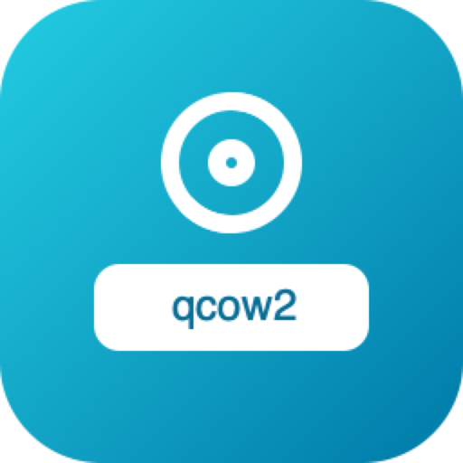
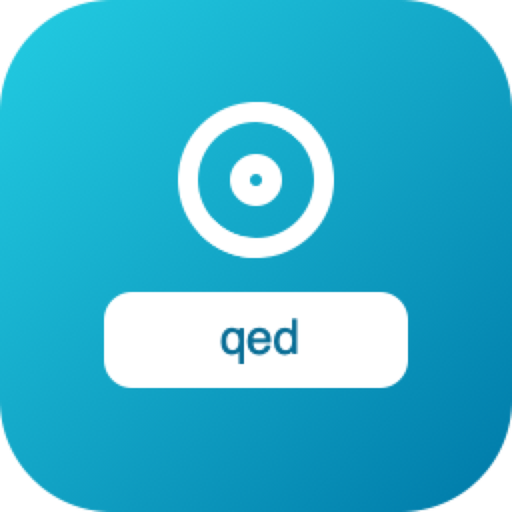
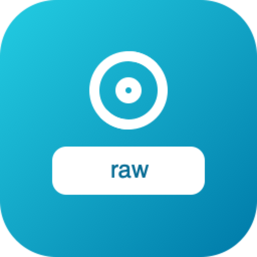
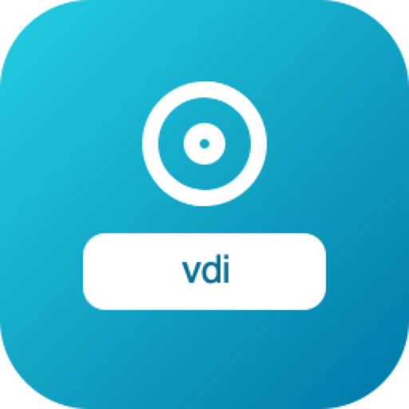

# go-diskimages — brand assets

Official logos for the **go-diskimages** organization.

## Formats

- **SVG** — `svg/color`, `svg/white` (white, transparent), `svg/black` (black, transparent)
- **PNG** 16→1024 px, 3 variants — `png/<variant>/<size>/`
- **JPG** (color, white background) — `jpg/<size>/`
- **ICO** (Windows) — `ico/`
- **ICNS** (macOS) — `icns/`
- **GitHub avatar** 512 px — `avatar/`
- **Social preview** 1280×640 (repo banner) — `social/`

## Repos (8)

| | repo |
|---|---|
|  | `dmg` |
|  | `qcow2` |
|  | `qed` |
|  | `raw` |
|  | `vdi` |
|  | `vhd` |
|  | `vhdx` |
|  | `vmdk` |

---
*Auto-generated assets — rounded square badge, line glyph, color / white / black variants.*
